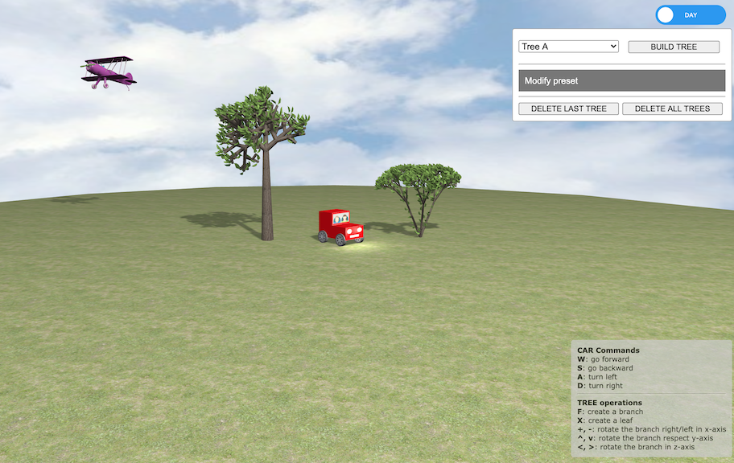

# Tree-Lsys
# Tree-Lsys
Final assignment for CG&3D exam.

We implemented a 3D scene to represent trees based on Lindenmayer system, as described [here](http://algorithmicbotany.org/papers/abop/abop-ch1.pdf). 

The project is written in Javascript with [Three.js](https://threejs.org/)framework, based on 
*WEBGL* API. 

It allows deterministic and stochastic grammars, with uniform probability, 

[qui](https://alessandraalf.github.io/Tree-Lsys)
